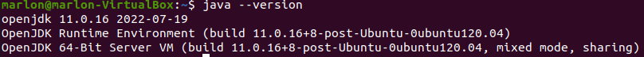
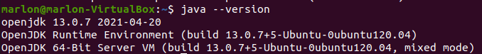
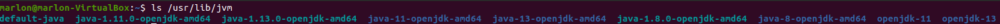
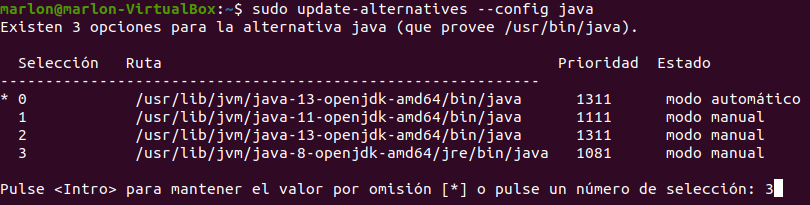

# Instalacion-de-JDK-en-el-Ubuntu

**Nombre:** Marlon Farizo Hergueta.

**Curso:** 1º Desarrollo de Aplicaciones Web.

**Asignatura:** Entornos de desarrollo.

### ÍNDICE

+ [Instalación de Java](#id1)
+ [Instalando versiones específicas](#id2)
+ [Configuración del entorno](#id3)

### Instalación de Java  

En un principio vamos a actualizar nuestra máquina para tener todas las librerías y procedemos a poner el comando para la instalación y comprobamos la versión instalada.

### Instalando versiones específicas 

Instalaremos diferentes versiones de Java.

Una vez instaladas nos daremos cuenta que se mantiene la versión mas reciente

### Configuración del entorno 

Ahora listaremos las versiones instaladas previamente y seleccionaremos la versión en la que queremos trabajar.

